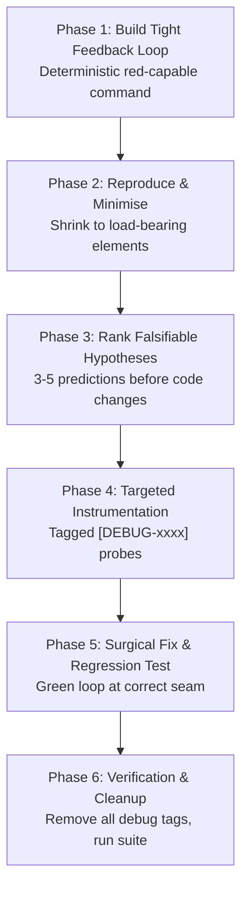

# /bug: Systematic 6-Phase Debugging Protocol

Combines the rigor of **Superpowers** and the disciplined feedback-loop protocol of **Matt Pocock**. Jumping straight to editing code without an automated failing signal is strictly forbidden.

---

## 🔬 The 6-Phase Debugging Loop

### Phase 1: Build a Tight, Red-Capable Feedback Loop
1. Construct **one test command** that:
   - Reproduces the exact error (goes **RED**).
   - Is deterministic and fast (<5s).
2. Execute: `harness tdd <test_path>` and verify RED state.

### Phase 2: Reproduce & Minimise
- Strip unnecessary payload fields or setup fixtures until only the load-bearing elements remain.

### Phase 3: Rank Falsifiable Hypotheses
- List 2-4 explicit hypotheses explaining the root cause.
- Define what evidence would prove or disprove each one.

### Phase 4: Targeted Instrumentation
- Add temporary debug probes tagged `[DEBUG-xxxx]`. Run the red command to inspect variables.

### Phase 5: Surgical Fix & Green Loop
- Apply the minimal fix at the root cause layer (not a surface patch).
- Verify the test turns **GREEN**.

### Phase 6: Verification & Cleanup
- Remove all `[DEBUG-xxxx]` probes.
- Run `harness qa all` to ensure zero regressions.
