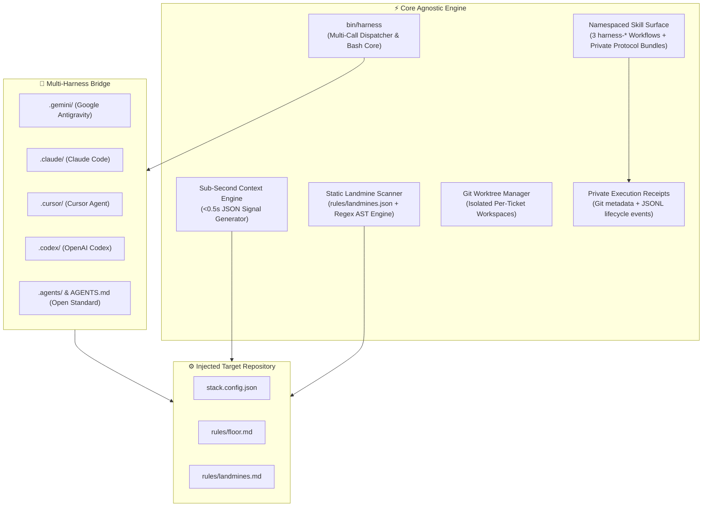

# 🏛️ Architecture & System Design

`agent-harness` is designed as a **small, shell-native engineering harness** that operates across AI coding agent runtimes without a language-runtime package bundle.

---

## 🧩 Architectural Layers

---

## ⚡ Core Design Principles

### 1. Minimal System Dependencies
- Written in Bash with no Node, Python, or compiled runtime bundle.
- Requires Git and `jq`; network and optional AI integrations additionally use `curl`.
- Keeps startup and installation overhead small by relying on standard system tooling.

### 2. Universal Multi-Harness Federation
- Installs `harness-implement`, `harness-fix`, and `harness-investigate` across `.gemini/skills`, `.claude/skills`, `.codex/skills`, and `.agents/skills`, plus runtime-specific rule directories such as `.cursor/rules`.
- The catalog's `harness` namespace is applied to every published directory and `SKILL.md` name; `--expert` exposes primitives through the same namespace.
- Each workflow bundle carries its required private protocol references, while the canonical catalog remains the single source of truth for public, internal, and removed skills.

### 3. Per-Runtime Skill Gating

Most skills are identical in every runtime, but a workflow may depend on a primitive only one runtime exposes. `core/skills/catalog.json` carries a `runtimes` map for that case: a public workflow listed there reaches only the runtimes it names, and a workflow absent from the map reaches all of them. `install.sh` resolves a runtime label for each destination directory and filters workflow installation by it.

Removal stays unconditional while installation is filtered. The installer clears every managed skill path in the catalog before installing the permitted set, so a workflow that becomes gated after a previous installation disappears from the disallowed runtimes on the next run, with no migration step. The compatibility matrix asserts both halves: presence where a workflow is declared, and absence everywhere else.

Internal primitives are never gated. Expert mode continues to expose all of them in every runtime.

### 4. Sub-Second Context Extraction
- `harness context --json` extracts the active profile, repository, branch/trunk, dirty state, configured test runner and issue provider, plus active-spec and debt counts in a compact JSON signal.
