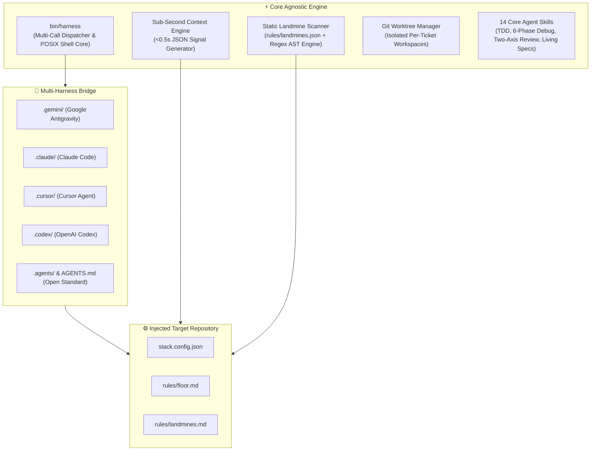

# 🏛️ Architecture & System Design

`agent-harness` is designed as a **zero-dependency, sub-second engineering harness** that operates across any AI coding agent runtime.

---

## 🧩 Architectural Layers

---

## ⚡ Core Design Principles

### 1. Zero External Dependencies
- Written entirely in clean, portable POSIX/Bash (`set -eo pipefail`).
- No heavy runtime overhead, node bundles, or Python dependencies required to run the CLI or hooks.
- Fast startup time (<50ms).

### 2. Universal Multi-Harness Federation
- Creates synchronized symbolic links across `.gemini/skills`, `.claude/skills`, `.codex/skills`, `.cursor/rules`, and `.agents/skills`.
- Single source of truth for living specs and domain rules.

### 3. Sub-Second Context Extraction
- `harness context --json` extracts git state, active branch, ticket metadata, modified files, and applicable floor rules in `< 500ms`, feeding agents exact signals without consuming tens of thousands of prompt tokens.
